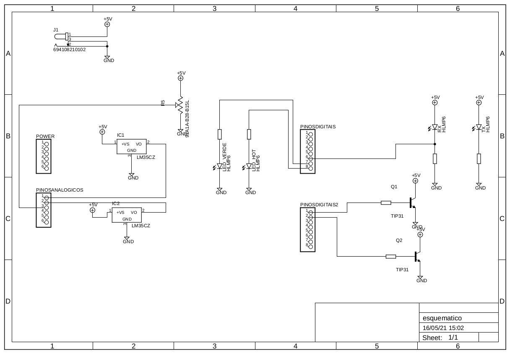
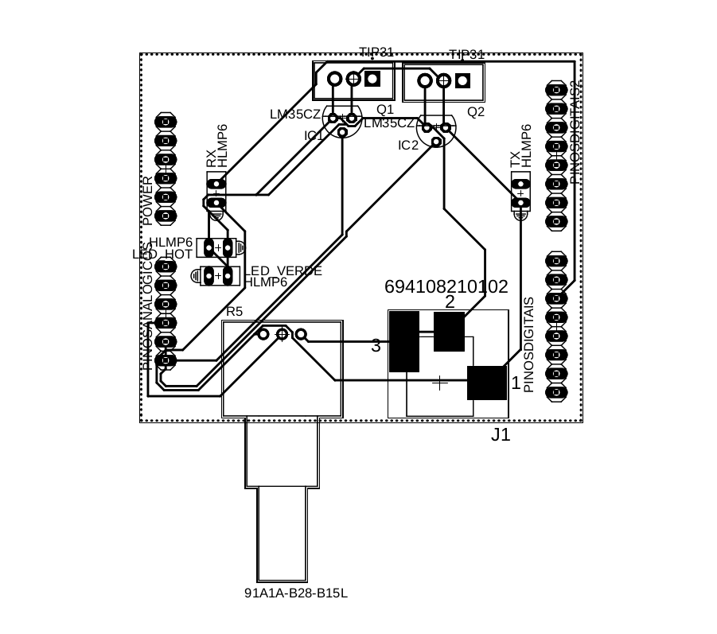
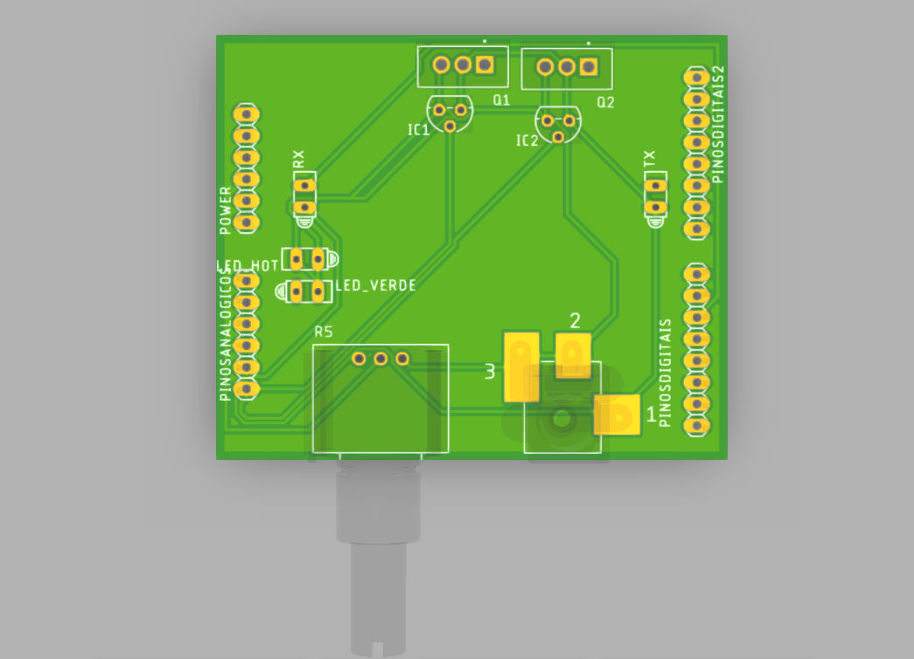
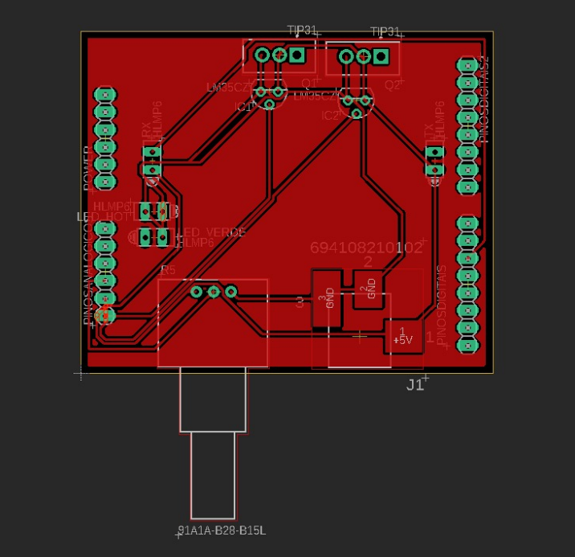
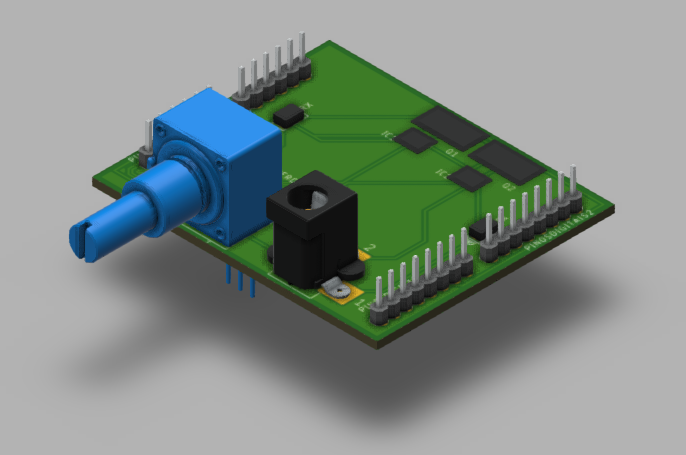
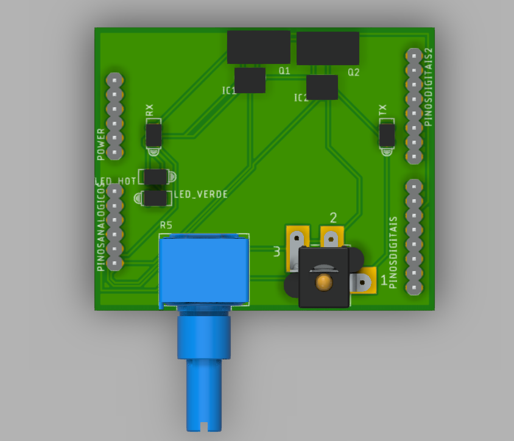

### Atividade de prototipagem

A atividade faz parte da disciplina **Técnicas de Prototipagem** ministrada pelos Professores Dr. **Moacy Pereira da Silva** e Dr. **Alexandre Sales Vasconcelos**, que consiste em desenvolver um shield para arduíno.<br /><br />

### Equipe

-   Diego Alex Maia de Lima
-   Edivam Enéas de Almeida Júnior<br /><br />

# PROJETO DE SISTEMA DE AQUISIÇÃO DE DADOS

### Sobre o shield

O shield é composto de três funcionalidades, sendo elas, um sistema de aquecimento, um sistema de controle de velocidade de motor com auxílio de transmissores e receptores infravermelhos e um sistema de conversão de um sinal analógico para um PWM que alimenta um led, configurando uma forma iterativa de observar e manipular a duração do pulso em nível lógico alto ou baixo de acordo com o nível de luminosidade do led.<br /><br />

👉 <a href="https://a360.co/3w6mWB6" target="_blank">Link do projeto 3D</a><br /><br />

### Componentes utilizados

- 2 LM35
- 2 TIP31C
- 2 resistores 470hms
- 1 resistor 330hms
- 1 resistor 10khms
- 2 resistores 220hms
- 2 leds
- 1 Led infravermelho IR - TX/RX
- 1 Potenciômetro 
- 1 motor dc (cooler)<br /><br />

### Download dos arquivos

👉 <a href="https://github.com/venzel/shield_dados/raw/master/arquivos/pcb/esquematico.zip" target="_blank">Arquivos do projeto</a><br />

👉 <a href="https://github.com/venzel/shield_dados/raw/master/arquivos/pcb/esquematico.zip" target="_blank">Documento em PDF do projeto</a><br /><br />

### Esquemático do circuito

<br /><br />

### Trilhas e Layer

<br /><br />

<br /><br />

<br /><br />

### Esquemático 3D

<br /><br />

<br /><br />

### Código de simulação

```c

int IN_4 = 4;
int IN_5 = 5;

void setup() {
    pinMode(IN_4, OUTPUT);
    pinMode(IN_5, OUTPUT);
}

void loop() {
    digitalWrite(IN_4, HIGH);
    digitalWrite(IN_5, HIGH);
}
```